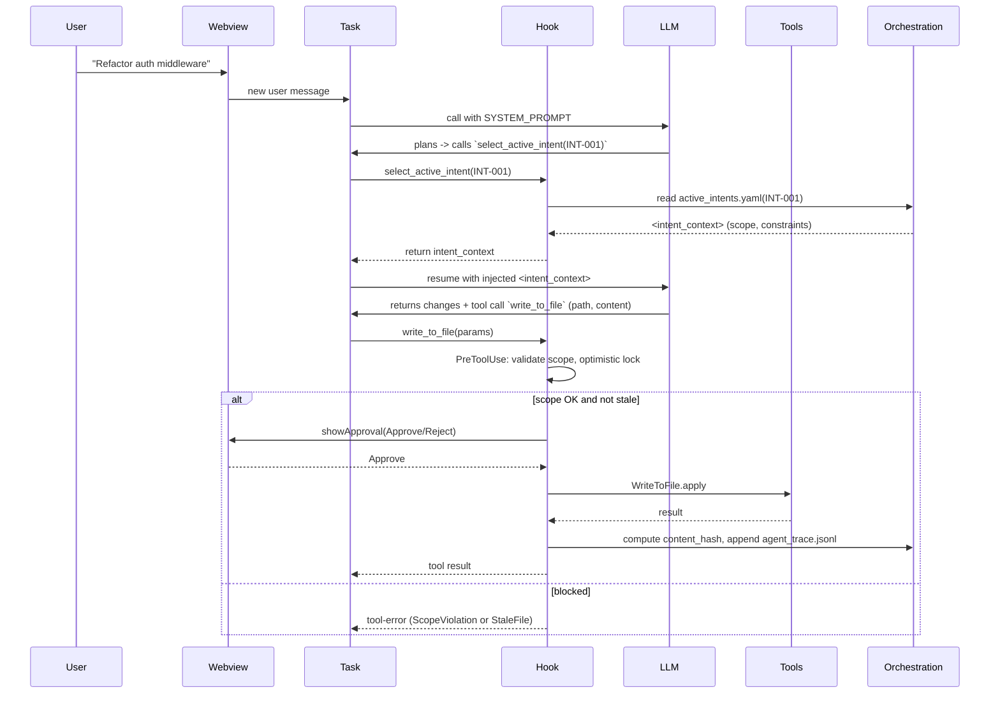

# Hook Architecture — Middleware & Hook Engine

This document describes the Hook Engine architecture for turning Roo Code into a governed AI-Native IDE. It contains component and sequence diagrams (Mermaid.js) and example schemas for the hook system.

## Goals

- Intercept all tool executions in a composable Pre/Post Hook pipeline.
- Enforce intent-context (Two-Stage Handshake).
- Record immutable Agent Traces linking Intent → AST → Code using spatial hashing.
- Provide Human-in-the-Loop (HITL) authorization for destructive actions.

## High-level Components

- Webview (UI): limited surface, posts messages to extension host.
- Extension Host: Task runtime, prompt builder (`SYSTEM_PROMPT`), tool dispatcher.
- Hook Engine: middleware that intercepts tool calls (PreToolUse, PostToolUse).
- Tools: `write_to_file`, `execute_command`, `read_file`, `select_active_intent`, etc.
- Sidecar store: `.orchestration/` (active_intents.yaml, agent_trace.jsonl, intent_map.md).
- VCS: Git revision id included in traces.

## Component Diagram (Mermaid)

```mermaid
flowchart LR
  subgraph UI
    W[Webview]
  end
  subgraph Host
    T[Task / Agent Runtime]
    P[SYSTEM_PROMPT (src/core/prompts/system.ts)]
    D[Tool Dispatcher]
    H[Hook Engine]
  end
  subgraph Tools
    WT[WriteToFile]
    EX[ExecuteCommand]
    RF[ReadFile]
    SA[SelectActiveIntent]
  end
  subgraph Orchestration
    ORC[.orchestration/]
  end

  W -->|postMessage| T
  T -->|build prompt| P
  T -->|invoke tool| D
  D --> H
  H --> WT
  H --> EX
  H --> RF
  H --> SA
  WT --> ORC
  SA --> ORC
  EX --> ORC
  ORC -->|read| H
```

## Handshake Sequence (Mermaid)



## Hook Pipeline — Concepts

- PreToolUse

    - Input: tool name, params, agent context (intent_id, read-hash if provided).
    - Responsibilities: validate intent, enforce `owned_scope`, compute optimistic-lock hash, request approval for destructive tools, block or allow.
    - Return: proceed | block (tool-error) | wait-for-approval.

- PostToolUse
    - Input: tool result, diffs, changed file path(s).
    - Responsibilities: compute spatial SHA-256 content hashes for changed blocks, append an Agent Trace entry to `agent_trace.jsonl`, update `intent_map.md` as needed, and optionally sign the trace.

## Example Agent Trace Record (JSON schema)

```json
{
	"id": "uuid-v4",
	"timestamp": "2026-02-18T12:00:00Z",
	"vcs": { "revision_id": "git_sha_hash" },
	"agent": { "session_id": "session-1234", "contributor": { "entity_type": "AI", "model_identifier": "gpt-x" } },
	"files": [
		{
			"relative_path": "src/auth/middleware.ts",
			"conversations": [
				{
					"url": "session-1234",
					"ranges": [{ "start_line": 15, "end_line": 45, "content_hash": "sha256:..." }],
					"related": [{ "type": "intent", "value": "INT-001" }]
				}
			]
		}
	]
}
```

- Implementation notes: compute `content_hash` using the exact block text (normalized newlines). Use a canonical serialization before hashing.

## Example `active_intents.yaml`

```yaml
active_intents:
    - id: "INT-001"
      name: "JWT Authentication Migration"
      status: "IN_PROGRESS"
      owned_scope:
          - "src/auth/**"
          - "src/middleware/jwt.ts"
      constraints:
          - "Must not use external auth providers"
          - "Maintain backward compatibility with Basic Auth"
      acceptance_criteria:
          - "Unit tests in tests/auth/ pass"
```

## Hook Interfaces (TypeScript — conceptual)

```ts
// PreHook result
type PreHookResult =
	| { action: "allow" }
	| { action: "block"; error: { code: string; message: string } }
	| { action: "waitForApproval"; approvalId: string }

// Hook signature
interface HookContext {
	toolName: string
	params: Record<string, unknown>
	intentId?: string
	userSessionId?: string
}

type PreHook = (ctx: HookContext) => Promise<PreHookResult>
type PostHook = (ctx: HookContext & { result: unknown }) => Promise<void>
```

## Approval UI contract

- For `waitForApproval`, the Hook Engine must post a UI message to the Webview (or show a native VS Code dialog). The reply must be an explicit approval or rejection. The UX should show `intent_id`, `changed_paths`, `diff_preview`, and `reason`.

## Optimistic Locking

- When agent reads a file, capture `read_hash` for the whole file or block. Attach `read_hash` to tool calls. PreHook compares `read_hash` to current on-disk hash; if mismatch, return `StaleFile` error.

## Security & Signing

- Consider signing appended trace entries using a workspace key (or short-lived signing key) to detect tampering. At minimum, append a checksum and Git revision snapshot.

## Rollout Steps (Minimal)

1. Add `select_active_intent` tool to `src/shared/tools.ts` types.
2. Create `src/hooks/HookEngine.ts` with Pre/Post hook registration.
3. Wire HookEngine into the tool dispatcher in `src/core/task/Task.ts` or the central tool dispatch path.
4. Wrap `WriteToFile` and `ExecuteCommand` with PreToolUse/PostToolUse.
5. Implement `agent_trace.jsonl` writer and `active_intents.yaml` read/write helpers.

## Appendix — Useful Mermaid Patterns

- Component diagrams: `flowchart`
- Sequence diagrams: `sequenceDiagram`
- State machines: `stateDiagram-v2`
